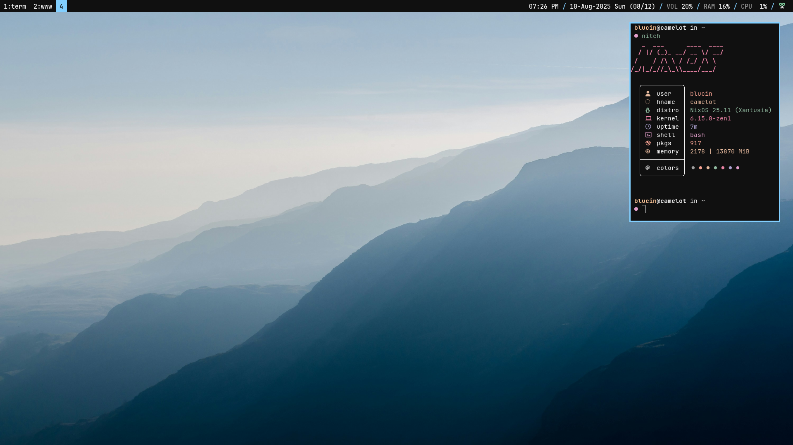

# NixOS dot files

This repo contains my NixOS configuration files with an i3wm setup :)



## Usage

1. Create your host configuration

```bash
cp /etc/nixos/configuration.nix ./hosts/default.nix
cp /etc/nixos/hardware-configuration.nix ./hosts/hardware-configuration.nix
```

2. Edit the `flake.nix` and `home.nix` for your user setup.

3. Update `Justfile` for your host and user.
